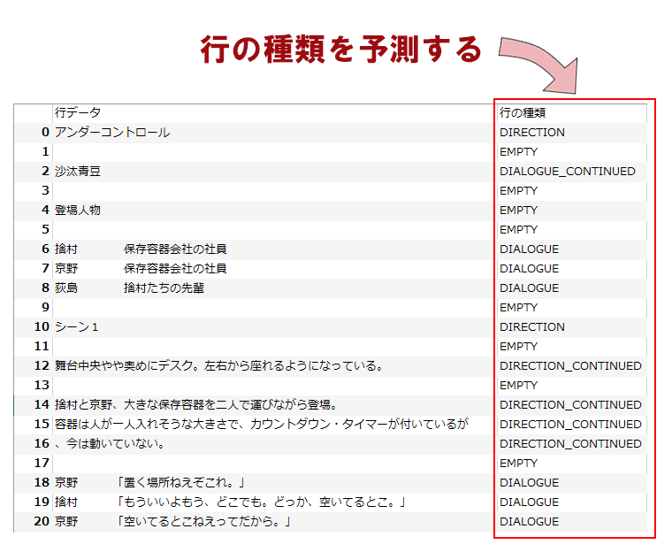

# 概要

台本として書かれた非構造化テキストデータを、決まったフォーマットの台本データに変換する AI を作ろうとしています。  
ただし、このプロジェクトの目的は、Chainer を勉強することです。

世の中の多くの台本は、「字下げしたテキスト」です。しかし、印刷以外のいろんな用途に利用するには、構造化が必要です。  
構造化したデータを台本っぽく見せるのは簡単ですが、台本っぽいテキストを構造化するのは難しいので、AI にやらせたいのです。


# 方針

- テキストの各行がセリフなのかト書きなのか、という分類を AI にやらせたい。

	

- 勉強が目的なので、まずはシンプルな Neural Network でやってみます。
	- LSTM 等の手法を使わないので、特徴量が無理やりな感じになると思います。
	- 実験なので、特徴量をころころ変えられるような設計にします。
- ライブラリは Chainer を使います。
- 「セリフ」「ト書き」などの種類を「行の種類」と呼ぶことにします。コード内では "classes" となっていますが、Python の class と紛らわしいので。
	- 教師データのラベルは「行の種類」です。

# 進捗

## 現状

- モデルを学習させることは出来てるっぽいです。
	- ほぼ [Chainer v4 ビギナー向けチュートリアル](https://qiita.com/mitmul/items/1e35fba085eb07a92560) のコピペです。
- 学習したモデルを使っての予測も、動いてはいるっぽいです。
- 教師データとテストデータが一個ずつしかありません。
- 特徴量がかなりテキトーです。

## 今後の予定

- 予測結果を、見やすい形で見れるような工夫を考えます。
- 予測に制限をかけて自然な結果になるような仕組みが必要です。
	- 「タイトル行は1行のみ」「セリフ行の後に登場人物行はない」等。
- 特徴量を、もうちょっと意味がありそうなのにして、増やします。
- 教師データとテストデータを増やします。
- 予測の部分を Web アプリにします。

# 定義

## 教師データ

- ラベル付き台本データ
	- [PSC](http://satamame.com/pscml/playscriptconv/) から出力した、各行が "ラベル,データ" 形式のテキストファイル
	- ラベルは「行の種類」です。
	- 例
		```
		H1,シーン２
		EMPTY,
		DIRECTION,　　そこへ課長が、本田を連れてくる。
		EMPTY,
		DIALOGUE,永子　　　「あ、課長。」
		DIALOGUE,課長　　　「（本田に）こちらが若月永子さんで、向こうが相原しのさんです。」
		DIALOGUE,本田　　　「向こう？？」
		```

- 「行の種類」一覧
	- "TITLE"
	- "AUTHOR"
	- "CHARSHEADLINE"
	- "CHARACTER"
	- "H1"
	- "H2"
	- "H3"
	- "DIRECTION"
	- "DIALOGUE"
	- "ENDMARK"
	- "COMMENT"
	- "EMPTY"
	- "CHARACTER_CONTINUED"
	- "DIRECTION_CONTINUED"
	- "DIALOGUE_CONTINUED"
	- "COMMENT_CONTINUED"

## 特徴量の設定

- 「どの特徴量を使うか」の設定
	- 特徴量の名前と、パラメタのセット。
		- 実装済みの特徴量の説明は、[docs/features.txt](docs/features.txt) にあります。
		- パラメタはモデルを鍛える時の重みやスレッショルドとして使います (特徴量によって使い方が変わります)。
	- パラメタは特徴抽出時には使われません。つまり、パラメタを変えても特徴量データを作り直す必要はありません。
	- モデルを鍛える時と予測に使う時で、パラメタを変えてはいけません。
	- 例
		```
		sc_count_of_lines, 1000
		sc_count_of_lines_with_bracket, 1000
		ln_count_of_words
		ln_count_of_brackets
		ln_length_of_common_head
		```

## 学習用データのための中間データ

1. 台本データ (ラベル有/無)  
	- e.g. train/tr_0000_sc.txt
1. 学習用ラベルデータ
	- e.g. train/tr_0000_lbl.txt
1. 特徴量データ (行ごと)
	- e.g. train/tr_0000_ft.csv

## 学習したモデル

- モデル : model/mdl_0000.pkl

# 処理 (プログラム) の分担

- 特徴量データ抽出 : psc_extract.py
- 学習 : psc_train.py
- 予測 : psc_predict.py

## 実行のしかた
[command_samples.md](docs/command_samples.md) を参照してください。
