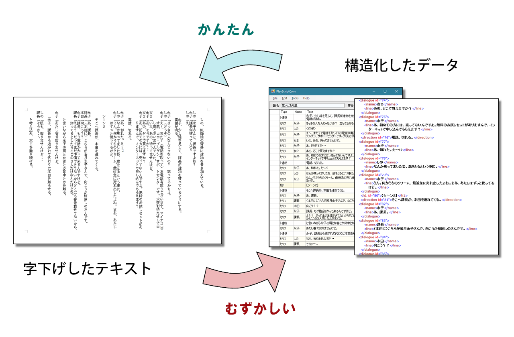

# 概要

台本として書かれた非構造化テキストデータを、決まったフォーマットの台本データに変換する AI を作ろうとしています。  
ただし、このプロジェクトの目的は、Chainer を勉強することです。

世の中の多くの台本は、「字下げしたテキスト」です。しかし、印刷以外のいろんな用途に利用するには、構造化が必要です。  
構造化したデータを台本っぽく見せるのは簡単ですが、台本っぽいテキストを構造化するのは難しいので、AI にやらせたいのです。



# 方針

- テキストの各行がセリフなのかト書きなのか、という分類を AI にやらせたい。
- 勉強が目的なので、まずはシンプルな Neural Network でやってみます。
	- LSTM 等の手法を使わないので、特徴量が無理やりな感じになると思います。
	- 実験なので、特徴量をころころ変えられるような設計にします。
- ライブラリは Chainer を使います。
- 「セリフ」「ト書き」などの種類を「クラス」と呼ぶことにします。学習用のラベル (教師データ) はクラスです。

# 進捗

## 現状

- モデルを学習させることは出来てるっぽいです。
- モデルを保存したり読み込んだりは出来てません。
- 教師データとテストデータが一個ずつしかありません。
- 特徴量がかなりテキトーです。

## 今後の予定

- 特徴量を、もうちょっと意味がありそうなのにして、増やしたいです。
- 教師データとテストデータを増やしたいです。
- 学習済みのモデルを使って予測をするプログラムを作りたいです。
- 予測の部分を Web アプリにしてみたいです。

# 定義

## 学習用データ

- ラベル付き台本データ
	- [PSC](http://satamame.com/pscml/playscriptconv/) から出力した、各行が "クラス,データ" 形式のテキストファイル
	- 例
		```
		H1,シーン２
		EMPTY,
		DIRECTION,　　そこへ課長が、本田を連れてくる。
		EMPTY,
		DIALOGUE,永子　　　「あ、課長。」
		DIALOGUE,課長　　　「（本田に）こちらが若月永子さんで、向こうが相原しのさんです。」
		DIALOGUE,本田　　　「向こう？？」
		```

- クラス一覧
	- "TITLE"
	- "AUTHOR"
	- "CHARSHEADLINE"
	- "CHARACTER"
	- "H1"
	- "H2"
	- "H3"
	- "DIRECTION"
	- "DIALOGUE"
	- "ENDMARK"
	- "COMMENT"
	- "EMPTY"
	- "CHARACTER_CONTINUED"
	- "DIRECTION_CONTINUED"
	- "DIALOGUE_CONTINUED"
	- "COMMENT_CONTINUED"

## 特徴量の設定

- 「どの特徴量を使うか」の設定
	- 特徴量の名前と、パラメタのセット。
		- パラメタはモデルを鍛える時の重みやスレッショルドとして使います (特徴量によって使い方が変わります)。
	- パラメタは特徴抽出時には使われません。つまり、パラメタを変えても特徴量データを作り直す必要はありません。
	- モデルを鍛える時と予測に使う時で、パラメタを変えてはいけません。
	- 例
		```
		sc_count_of_lines, 1000
		sc_count_of_lines_with_bracket, 1000
		ln_count_of_words
		ln_count_of_brackets
		ln_length_of_common_head
		```

## 学習用データのための中間データ

1. 台本データ (ラベル有/無)  
	- e.g. train/tr_0000_sc.txt
2. 形態素データ
	- e.g. train/tr_0000_mrph.json
3. 学習用ラベルデータ
	- e.g. train/tr_0000_lbl.txt
4. 特徴量データ (行ごと)
	- e.g. train/tr_0000_ft.txt

## 学習したモデル

- モデル : model/mdl_0000.pkl

# 処理 (プログラム) の分担
※まだ実装が完了していません。

- 形態素解析 : psc_morph.py
	- usetrain.ini に関係なく、引数として与えたファイルに対して実行。
	- 第1引数 : 入力
	- 第2引数 : 形態素データの出力先
	- 第3引数 : 学習用ラベルの出力先 (あれば)
- 特徴量データ抽出 : psc_extract.py
	- 形態素データと、特徴量の設定を元に、台本内の各行の特徴量を抽出。
	- 台本全体の特徴は、同じ台本から取ったすべての行の特徴にコピーされる。
		- ※モデルへの入力を簡単にし、違う台本の行を混ぜて学習するため。
	- 第1引数 : 入力（形態素データ）
	- 第2引数 : 特徴量設定ファイル
	- 第3引数 : 出力 (特徴量データ)
- 学習 : psc_train.py
	- usetrain.ini で設定した複数のファイルに対して実行。
	- usefeat.ini で設定した特徴量設定で、設定されている特徴量だけを使って学習する。
	- 特徴量設定ファイルにセットされているパラメタを使う。
	- 学習したモデルを保存する。
	- 第1引数 : 入力（特徴量データのリスト）
	- 第2引数 : 特徴量設定ファイル
	- 第3引数 : 出力 (モデル)
- 予測 : psc_predict.py
	- 学習したモデル (model/mdl_xxxx.pkl) を読み込む。
	- 台本データに変換したいテキストデータを読み込む。
	- 形態素解析する。
	- 台本固有のデータを抽出する。
	- 台本ごとの特徴量を抽出する。
	- 各行の特徴量を抽出しながら、クラス名を予測する。
	- 登場人物行、セリフ行については、区切りを予測して区切る。
	- PSCML (または何らかの台本フォーマット) として出力。

## 実行のしかた
[command_samples.txt](docs/command_samples.txt) を参照してください。
